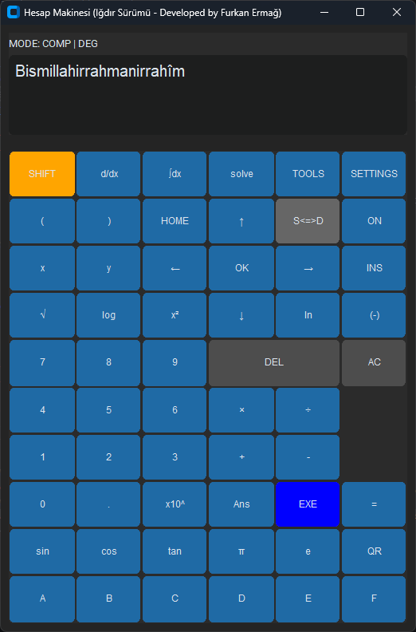

# Python Bilimsel Hesap Makinesi

Bu proje, Furkan Ermağ tarfından Üniversite Ödevi olarak Python programlama dili ve `customtkinter` kütüphanesi kullanılarak geliştirilmiş, Casio FX-99ICW modeline benzer bir arayüze ve işlevselliğe sahip bilimsel bir hesap makinesi uygulamasıdır.

## Özellikler

*   Temel aritmetik işlemler (+, -, ×, ÷)
*   Trigonometrik fonksiyonlar (sin, cos, tan, asin, acos, atan) - Derece/Radyan modu desteği
*   Logaritmik ve üstel fonksiyonlar (log, ln, 10^x, e^x)
*   Karekök, küpkök, kare, küp alma
*   Sabitler (π, e)
*   Değişken depolama (A, B, C, D, E, F, Ans)
*   Sembolik işlemler (türev, integral, denklem çözme - `sympy` ile)
*   Sonucu standart (kesirli/sembolik) ve ondalık form arasında değiştirme (S<=>D)
*   Modern ve özelleştirilebilir arayüz (`customtkinter`)

## Prompt
"Python'da customtkinter kütüphanesini kullanarak, Casio FX-99ICW bilimsel hesap makinesindeki tüm tuşları ve işlevselliği içeren bir bilimsel hesap makinesi uygulayan bir Python betiği oluşturun. Hesap makinesi; rakamlar (0-9), operatörler (+, -, ×, ÷, =), matematiksel işlevler (QR, √, x², log, ln, sin, cos, tan, Ans, (, ), x10^, π, e), mod ve navigasyon tuşları (on, HOME, SETTINGS, ok tuşları, OK), fonksiyon tuşları (SHIFT, VARIABLE, FUNCTION, CATALOG, TOOLS), değişken tuşları (A, B, C, D, E, F) ve özel tuşlar (FORMAT, EXE, INS, AC, (-)) içermelidir. Ekran, çok satırlı bir monokrom ekran olacak ve üst kısmında 'Spreadsheet,' 'Table,' 'XY=0 Equation,' 'Inequality,' 'Complex,' 'Base-N' mod simgeleri bulunacaktır. Aritmetik işlemleri standart işlem önceliği kurallarına göre değerlendirin, trigonometrik işlevler (sin, cos, tan) için derece/radyan geçişi destekleyin, logaritmik ve üstel işlevler (log, ln, x10^) ekleyin. Türev ve integral hesaplamaları için SymPy, matris işlemleri için NumPy kullanın. Kullanıcıların A, B, C, D, E, F ve Ans değişkenlerinde değer saklamasına izin verin. Geçersiz girişler için kullanıcı dostu hata mesajları gösterin. Arayüz, Casio FX-99ICW’nin düzenini taklit ederek sezgisel olmalı. Kodu modüler hale getirin (GUI, hesaplama, değişken yönetimi için ayrı bölümler) ve her bölümü açıklayan yorumlar ekleyin. Test senaryoları olarak temel aritmetik ('2 + 3 × 4'), trigonometri ('sin(30)' derece) ve denklem çözme ('solve(x² - 4, x)') işlemlerini kullanın. Tüm import’ları, sınıf tanımlarını ve işlev uygulamalarını içeren tam bir Python kodu sağlayın."

bunu sıralı bir şekilde yapmak için prd yaz

## Ekran Görüntüsü



## Kurulum ve Çalıştırma

1.  **Gerekli Kütüphaneler:**
    ```bash
    pip install customtkinter sympy numpy
    ```
2.  **Çalıştırma:**
    ```bash
    python main.py
    ```

## Katkıda Bulunma

Katkılarınız için lütfen bir "issue" açın veya "pull request" gönderin.

## Lisans

Bu proje MIT Lisansı altında lisanslanmıştır.
